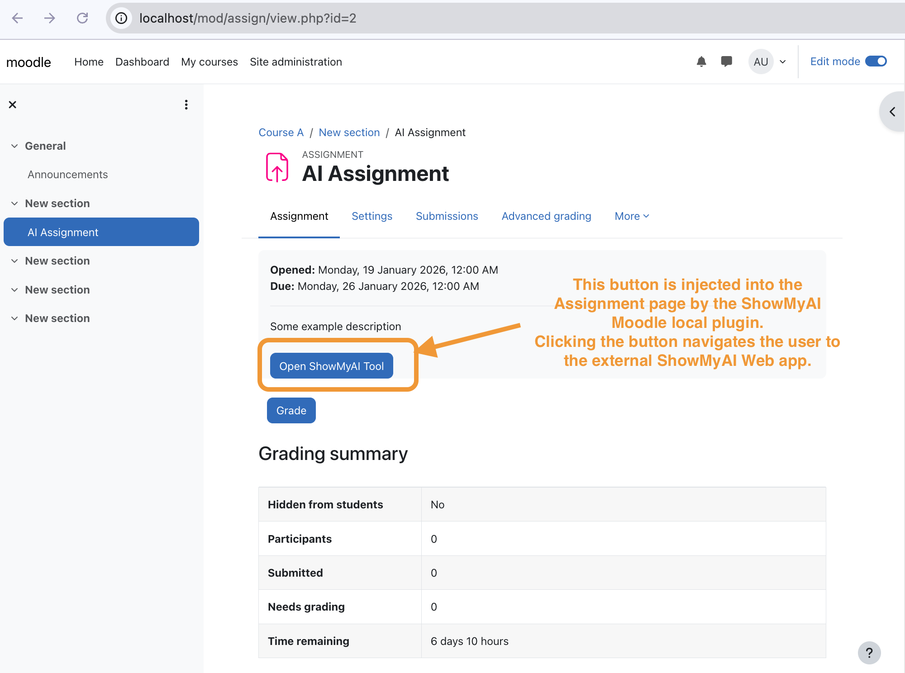
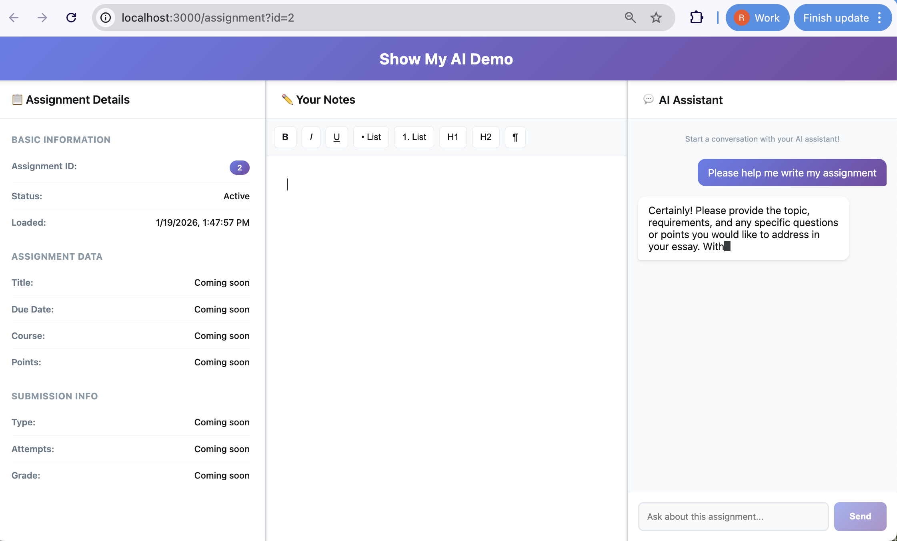

# Moodle Custom Plugin Demo

This repository demonstrates a custom Moodle plugin called **ShowMyAI** that adds a button to assignment pages so that clicking the button will navigate to the ShowMyAI mock web app.

Screenshot showing the "Show My AI" button injected onto a Moodle assignment page:



Screenshot showing the mock Show My AI Web app which is opened in a new tab after clicking the plugin button:



## Prerequisites

- Docker and Docker Compose to run a local Moodle instance
- Node.js (v14 or higher) and NPM to build the plugin

## Setup

### 1. Build and Package the Plugin

Before starting Moodle, build the plugin and create the distribution package:

```shell
bash build-plugin.sh
```

This will:

- Install Grunt and build dependencies
- Minify the JavaScript AMD modules from `amd/src/` to `amd/build/`
- Create `plugin_showmyai.zip` ready for distribution

Alternatively, you can run the commands manually:

```shell
cd plugins/showmyai
npm install
npm run build
cd ../..
```

### 2. Start Moodle

Start Moodle using Docker Compose command below.

This may take a few minutes on the first run as Moodle takes a while to initialise the database.

```shell
docker compose up
```

### 3. Download Ollama Model

For local AI testing, the Ollama service needs to download the phi3 model. After the services are running, execute the following command:

```shell
docker exec -it alpine-moodle-ollama-1 ollama pull phi3
```

This will download the phi3 model to the Ollama service. The model is stored in a Docker volume and only needs to be downloaded once.

**Note:** The container name may vary depending on your Docker Compose version. You can check the exact name with `docker ps` and look for the ollama container.

**Alternative models:** To use a different model, pull it with `ollama pull <model-name>` and update the `OLLAMA_MODEL` environment variable in `docker-compose.yml`.

### 4. Access Moodle

Navigate to Moodle in your browser at `http://localhost`

Login with the credentials configured in `docker-compose.yml`:

- Username: `moodleuser`
- Password: `PLEASE_CHANGEME`

### 5. Manually Install Plugin

After logging into Moodle navigate to the plugin installation page:

`Site Administration` > `Plugins` > `Install Plugins` > `Upload plugin zipfile` > `Confirm plugin install`

Verify the plugin is installed:

`Site Administration` > `Plugins` > `Plugins Overview`

The plugin zipfile can also be uploaded to any other Moodle instance if desired.

## Plugin Development

For development workflow and adding new AMD modules, see `plugins/showmyai/BUILD.md`

### Quick Development Commands

```shell
cd plugins/showmyai

# Build once
npm run build

# Watch for changes (auto-rebuild)
npm run watch
```
